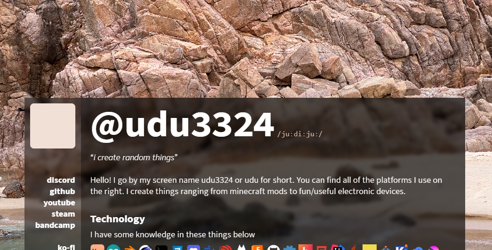

# uduhome

A simple portfolio website with my projects, interests, and more baked inside. Built with Astro, Tailwindcss, and Svelte components. 

[See my website here!](https://uduhome.vercel.app/)

## Features

* Random background and theme every page refresh
* Neat little section with cool research papers
* Can be viewed on an iPhone 6
* Fast image loading and caching for best user experience
* Clarifies how my screen name is pronounced
* Uses mbid database from MusicBrainz to fetch for album images
* Projects can be easily set in a json file and adding an image to `src/assets/projects`

## Credits

**Font**
* [Nebula Sans](https://nebulasans.com/) by The Nebula Team.

**Inspiration**
* [Alice's Site](https://alice.hackclub.app) (dynamic color and background)
* [Finji Blog Site](https://finji.co/news/2025/05/22/WWIO-switch.html) (page format)

## Commands for CLI

All commands are run from the root of the project, from a terminal:

| Command                   | Action                                           |
| :------------------------ | :----------------------------------------------- |
| `npm install`             | Installs dependencies                            |
| `npm run dev`             | Starts local dev server at `localhost:3000`      |
| `npm run build`           | Build your production site to `./dist/`          |
| `npm run preview`         | Preview your build locally, before deploying     |
